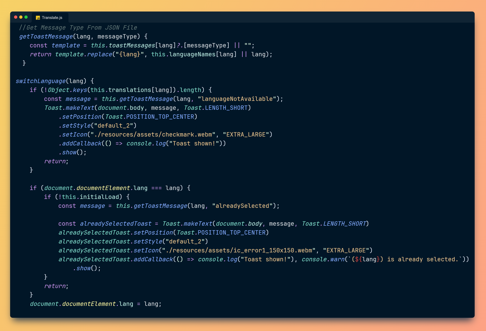

<div>
  <!-- Library Version -->
  <a href="https://soufianodev.github.io/Toast-JS/docs/docs_v2_0_0.html" target="_blank">
  &nbsp;&nbsp;&nbsp;

  <!-- JavaScript -->
  <a href="https://www.javascript.com" target="_blank">
    
  </a>
  &nbsp;&nbsp;&nbsp;

  <!-- React -->
  <a href="https://react.dev/" target="_blank">
    
  </a>
  &nbsp;&nbsp;&nbsp;
  &nbsp;&nbsp;&nbsp;
&nbsp;&nbsp;&nbsp;

  <!-- Instagram -->
  <a href="https://www.instagram.com/soufiane_hanane1?igsh=N2d6ZTJ1ZGttZG41/" target="_blank">
    
</a>
  </a>
</div>

<h1 class="title"><strong>🍞 Toast-JS Library  - By Soufiano Dev 🎩🪄</strong></h1>

<div align="center">
  
</div>

## Introduction

**Toast-JS** is an open-source JavaScript library created by **Soufiano Dev** 🎉. It provides an elegant, flexible, and developer-friendly way to display toast notifications in your web applications. It also supports integration with React.

### Why Choose Toast-JS?

- 🚀 **Customizable**: Easily style and animate toasts to match your app's theme.
- 🎨 **Predefined Styles**: Choose from success, error, warning, and info notifications.
- 🌍 **Accessible**: Fully customizable icons, animations, and positions.
- 🛠️ **Developer-Friendly**: Minimal setup and robust API.
- ⚛️ **React Support**: Seamlessly integrate with React applications.

### Quick Links

- <a href="https://soufianodev.github.io/Toast-JS/docs/docs_v2_0_0.html" target="_blank">Full Documentation 📚</a>
- <a href="https://soufianodev.github.io/Toast-JS/Demo/demo_v2_0_0.html" target="_blank">JavaScript Live Demo 🔗</a>
- <a href="https://soufianodev.github.io/Toast-JS/Demo/demo_React+Toast-JS_v2_0_0.html" target="_blank">React Live Demo ⚛️ 🔗</a>

### **Demo Test:**


# Installation:

### Add Toast.js to Your Project

Include the library via CDN in your HTML file:

```html
<script src="https://soufianodev.github.io/Toast-JS/libs/js/v2.0.0/Toast.js"></script>
```

Add the notification container to your body:

```html
<div id="toast-notification" class="toast-notification"></div>
```

## Simple HTML Example

```javascript
const toast = Toast.makeText(document.body, "Hello Toast", Toast.LENGTH_SHORT).show();
```

Here's a basic HTML file demonstrating Toast-JS:

```html
<!DOCTYPE html>
<html lang="en">
  <head>
    <meta charset="UTF-8" />
    <meta name="viewport" content="width=device-width, initial-scale=1.0" />
    <title>Toast.js Example</title>
  </head>
  <body>
    <!-- Notification Container -->
    <div id="toast-notification" class="toast-notification"></div>

    <!-- Buttons to Trigger Toasts -->
    <button onclick="showSuccessToast()">Show Success Toast</button>
    <button onclick="showErrorToast()">Show Error Toast</button>

    <!-- Include Toast.js Library -->
    <script src="https://soufianodev.github.io/Toast-JS/libs/js/v2.0.0/Toast.js"></script>

    <!-- Example Scripts -->
    <script>
      function showSuccessToast() {
        const successToast = Toast.makeText(
          document.body,
          "✅ Success! Operation completed.",
          Toast.LENGTH_SHORT
        );
        successToast.setStyle(Toast.STYLE_SUCCESS)
        successToast.setPosition(Toast.POSITION_TOP_CENTER)
        successToast.setAnimation(Toast.SLIDE_IN_TOP_CENTER,Toast.SLIDE_OUT_TOP_CENTER)
        successToast.show();
      }

      function showErrorToast() {
        const errorToast = Toast.makeText(
          document.body,
          "Error! Something went wrong.",
          Toast.LENGTH_LONG
        );
        errorToast.setStyle("error"); //Toast.STYLE_ERROR
        errorToast.setPosition(Toast.POSITION_TOP_RIGHT);
        errorToast.setAnimation(Toast.WOBBLE_IN, Toast.WOBBLE_OUT);
        errorToast.show();
      }
    </script>
  </body>
</html>
```

## Usage Examples

### ✅ Success Toast

Use this toast to show success messages (e.g., operation completed).

```javascript
const successToast = Toast.makeText(document.body, "✅ Success! Your action was completed successfully.", Toast.LENGTH_SHORT);

    successToast.setStyle("success") // Toast.STYLE_SUCCESS
    .setPosition(Toast.POSITION_BOTTOM_CENTER)
    .setAnimation(Toast.WAVE_IN,Toast.WAVE_OUT)    
    .show();
```

### ❌ Error Toast

Display error notifications with a predefined error style.

```javascript
const errorToast = Toast.makeText(
  document.body,
  "Oops! Something went wrong. Please try again later.",
  Toast.LENGTH_LONG
);
    errorToast.setStyle(Toast.STYLE_ERROR)
    .setPosition(Toast.POSITION_TOP_RIGHT)
    .setAnimation(Toast.SLIDE_IN_TOP,Toast.SLIDE_OUT_TOP)
    .setDismissible(true,"#fff")
    errorToast.show();
```

### ℹ️ Information Toast

Use for informational messages, like user tips or updates.

```javascript
const infoToast = Toast.makeText(document.body, "ℹ️ Here's an important update for you!", Toast.LENGTH_SHORT);

    infoToast.setStyle("info"); // Toast.STYLE_INFO
    infoToast.setPosition(Toast.POSITION_TOP_LEFT);
    infoToast.setAnimation(Toast.FADE);
    infoToast.show();
```

### 🎨 Custom Toast

Create a unique toast with custom styles, icons, and animations.

```javascript
const toast = Toast.makeText(
  document.body,
  " This is a beautifully styled custom toast!",
  Toast.LENGTH_LONG
);

let toastStyle = {
  background: "linear-gradient(90deg, #ff7eb3, #ff758c)",
  color: "#fff",
  borderRadius: "10px",
  padding: "15px",
  fontSize: "16px",
  boxShadow: "0 5px 15px rgba(0, 0, 0, 0.3)",
};

toast
  .setStyle(toastStyle)
  .setIcon("./assets/custom-icon.svg", Toast.ICON_SIZE.EXTRA_LARGE) // You Can Add An Image Using Link
  .setPosition(Toast.POSITION_BOTTOM_RIGHT)
  .setAnimation(Toast.SLIDE_BOTTOM_RIGHT, Toast.SLIDE_BOTTOM_OUT)
  .show();
```


### **SetIcon Using URL:**

```javascript
let iconUrl =
  "https://soufianodev.github.io/Toast-JS/assets/checkmark_150x150.webm";

const toastIcon = Toast.makeText(document.body, "Hello Toast Icon");
toastIcon.setStyle(Toast.STYLE_DEFAULT_2); // you can use   toastIcon.setStyle("defult_1")
toastIcon.setIcon(iconUrl); //Supported formats: .svg , .png, .jpg, .jpeg, .gif, .webm, .mp4.
toastIcon.show();
```

### ⏳ Custom Duration Toast

Set a custom duration for your toast notification.

```javascript
const customDurationToast1 = Toast.makeText(
  document.body,
  "This toast will be visible for 9 seconds.",
  9000
); // 9 seconds
customDurationToast1.setStyle("info");
customDurationToast1.setPosition(Toast.POSITION_BOTTOM_LEFT);
customDurationToast1.show();
```

### ⏲️ Another Custom Duration Example

```javascript
const customDurationToast2 = Toast.makeText(
  document.body,
  "This toast will be visible for 15 seconds.",
  Toast.LENGTH_SHORT
); // LEGTH_SHORT = 3000 But now Duration = 15000
customDurationToast2.setDuration(15000); // 15 seconds
customDurationToast2.show();
```

### **Make toast dismissible:**

```javascript
const toast = Toast.makeText(document.body, "Hello Toast", Toast.LENGTH_SHORT);
toast.setDismissible(true);
toast.show();
```

### **Make toast dismissible with custom close button color:**

```javascript
const customCloseToast = Toast.makeText(
  document.body, "This toast has a custom close button color!", 7000);  //Note: Toast notification will be automatically hidden if duration < 6.5 seconds.

customCloseToast.setStyle(Toast.STYLE_LIGHT_MODE)
.setPosition(Toast.POSITION_TOP_CENTER)
// .setDuration(7000) 
.setDismissible(true,"#000000") // Set close button color to black);
customCloseToast.show();

```


## Using Toast-JS with React

To use **Toast-JS** in a React web application, follow these steps:

1. **Include the Toast.js Library**: Add the Toast.js script to your HTML file.

```html
<script src="https://soufianodev.github.io/Toast-JS/libs/js/v2.0.0/Toast.js"></script>
```

2. **Create a React Component**: Create a React component that will use the **Toast-JS** library to display notifications. Ensure your HTML file has a root element where the React component will be rendered, and include the notification container.

```html
<div id="root"></div>
<div id="toast-notification" class="toast-notification"></div>
```

3. **React Component Example**: Here is a simple React component that demonstrates how to use Toast.js.

```javascript
import React from 'react';
import ReactDOM from 'react-dom';

class App extends React.Component {
  showToast = () => {
    const toast = Toast.makeText(
      document.body,
      "Hello I'm a Toast From React!",
      Toast.LENGTH_SHORT
    );
    toast.setStyle(Toast.STYLE_SUCCESS);
    toast.setPosition(Toast.POSITION_TOP_CENTER);
    toast.show();
  };

  render() {
    return (
      <div>
        <button onClick={this.showToast}>Show Toast</button>
      </div>
    );
  }
}

ReactDOM.render(<App />, document.getElementById('root'));
```

## **Actual Use Of The Library By Dev Soufiano :**

</img>

### **Script:**

<div style="display: flex; justify-content: center;">
  
</div>

## Features

- ✅ **Predefined Styles :** Success, error, info, warning, gradient, neon, metallic, glow, transparent, and more.
- 🖌️ **Custom Decorations :** Set your own background, fonts, borders, and shadows.
- 🎥 **Dynamic Icons :** Add images, SVGs, or videos (webm & mp4) as toast icons.
- 🎭 **Animations :** Fade, slide, light-speed, wave, wobble, and custom keyframe animations.
- 🌐 **Positioning :** Display toasts at various screen locations (top-left, top-center, bottom-right, etc.).
- ⏲️ **Custom Durations :** Define how long each toast should remain visible.
- 🔄 **Responsive Design :** Automatically adjusts layout for smaller screens.
- ⚛️ **React Support :** Easily integrate with React web applications.

## Adding Toasts to Your Application

1. Include the **Toast-js** CDN in your HTML file.
2. Add the `<div id="toast-notification"></div>` to your HTML body.
3. Create toast notifications using the API methods, e.g., `Toast.makeText`.

## Developer Notes
- For a better, easier, and faster experience when working with the Toast-JS library, it is recommended to develop your project in the <a href="https://www.jetbrains.com/webstorm/" target="_blank">WebStorm IDE</a> if you have the capability. However, if not, there's no issue you can work normally within the <a href="https://code.visualstudio.com/"  target="_blank"  >Visual Studio</a> Code environment.

<a href="https://www.jetbrains.com/webstorm/" target="_blank">
<div align ="center">

</div>
</a>
&nbsp;&nbsp;&nbsp;

- Toast-Js is authored by **Soufiane Hanane**. The library prioritizes ease of use while offering extensive customization options for developers. For full documentation, visit <a href="https://soufianodev.github.io/Toast-JS/docs/docs_v1.0.0/docs.html">Toast-JS V2.0.0 Docs 📚</a>

### Old Versions

<a href="https://soufianodev.github.io/Toast-JS/docs/docs_v2_0_0.html">Toast-JS V2.0.0 Docs 📚</a>

---

Created with 💛💜 by **Soufiano Dev** | Made in **Morocco** 🇲🇦
